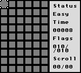
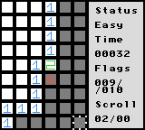
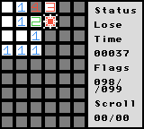
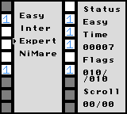
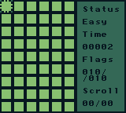
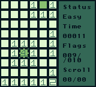
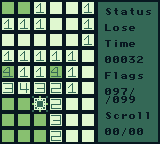
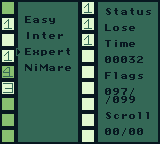

# Minesweeper Gameboy
This is a port/demake of the Microsoft game Minesweeper. The game works both for the Gameboy and the Gameboy colors, with enhanced colors for the latter.

While I do have a Gameboy (Color) I wasn't able to test it on official hardware due to a lack of ability to load it to a cartridge. The ROM file was tested on [BGB](https://bgb.bircd.org/) and [Emuclius](https://emulicious.net/).

# Gameplay (from Wikipedia)
In Minesweeper, mines (that resemble naval mines in the classic theme) are scattered throughout a board, which is divided into cells. Cells have three states: uncovered, covered and flagged. A covered cell is blank and clickable, while an uncovered cell is exposed. Flagged cells are those marked by the player to indicate a potential mine location.

A player left-clicks a cell to uncover it. If a player uncovers a mined cell, the game ends, as there is only 1 life per game. Otherwise, the uncovered cells displays either a number, indicating the quantity of mines diagonally and/or adjacent to it, or a blank tile (or "0"), and all adjacent non-mined cells will automatically be uncovered. Right-clicking on a cell will flag it, causing a flag to appear on it. Flagged cells are still considered covered, and a player can click on them to uncover them, although typically they must first be unflagged with an additional right-click.

The first click in any game will never be a mine.

To win the game, players must uncover all non-mine cells, at which point, the timer is stopped. Flagging all the mined cells is not required.

# GB Modifications (rules)
Instead of using the mouse and left/right clicks the player uses the d-pad and the A and B buttons to navigate.
- A is used to open tiles.
- B is used to flag and unflag tiles
- All mines need to be flagged to win.
- Start is used to restart the game.
- Select opens a difficulty select screen.

## Board sizes
1. Easy: 10x10 with 10 bombs.
2. Intermediate (Inter): 16x16 with 40 bombs.
3. Expert: 22x22 with 99 bombs.
4. Nightmare (NiMare): 32x32 with 200 bombs.

WARNING: While large board sizes are available the Gameboy takes a lot of time to place the bombs, it might freeze for around a minute and a half while placing the bombs, but should then work clearly.

# Use instructions
The latest version should be available in the releases tab. Downloading the ROM from there is easy and should let you play immediately.

If you want to build the files yourself it's possible.
- Clone or download the git repository.
- Download [GBDK 2020 (Gameboy Development Kit 2020)](https://github.com/gbdk-2020/gbdk-2020).
- If you are using a Windows PC modify the file source of LCC in the build.bat  file, and execute it. It should create the ROM in the Build directory.
- Else, follow GBDK 2020's instruction on how to compile in your operating system. Keep in mind to allow Gameboy Color compatibility, which is disabled in the compiler by default.

# Images
## GBC

## GB

# Bug reports and support
Feel free to submit all bug reports and code changes ideas and requests to the corresponding tabs in GitHub. 

# License
This project is licensed under the Apache License 2.0.

# Attribution
Gameplay section provided by Wikipedia under the "Creative Commons Attribution-ShareAlike" license. This is not endorsed by Wikipedia or its writers.
